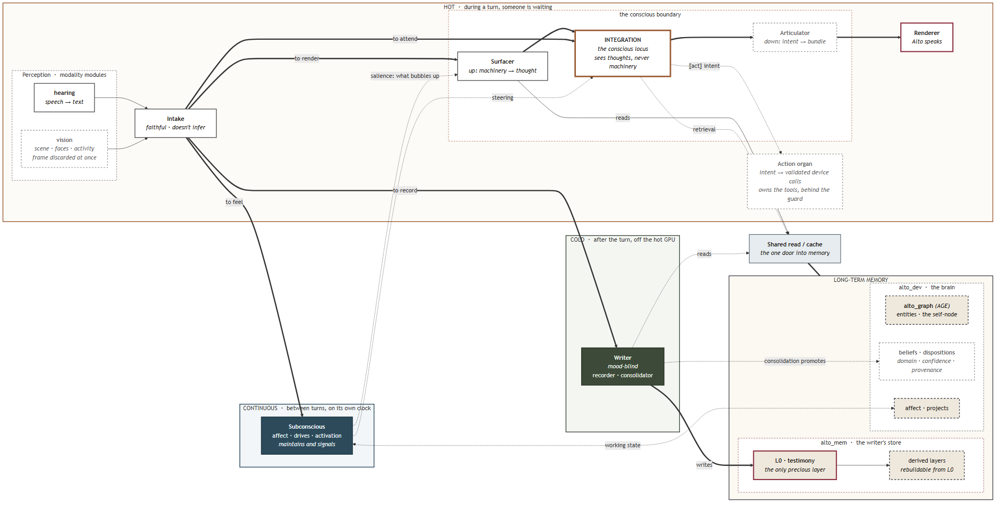

# The organs — a map

*One diagram and one table. This page stays thin on purpose: it tells you what the parts are
and where they sit, and hands you off. Each organ's own page carries the depth, keeping **what
is built today** and **what it is ultimately meant to be** in separate sections so the current
scaffolding never reads as the design.*

Alto is a home assistant on the surface. Underneath it is a research program about **machine
interiority**. The assistant is the vehicle; the interior is the point. Read
[PILLARS.md](PILLARS.md) first if you have not — without it, several of these organs look like
over-engineering.

---

## The system in one picture

*Source: [alto-organs-overview.mmd](assets/alto-organs-overview.mmd) — edit the `.mmd` and
re-render, never the PNG alone. This is the orientation view. The full reference, with every
signal path and schema by name, is
[alto-architecture-2026-09.png](assets/alto-architecture-2026-09.png)
([.mmd](assets/alto-architecture-2026-09.mmd)).*

## How to read it

**The bands are the organizing idea.** Every organ sits in exactly one, and which one tells
you most of what you need before reading any of its code:

| Band | When | Budget | Failure mode |
|---|---|---|---|
| **Hot** | during a turn, someone is waiting | milliseconds — it is felt | never block; degrade, don't crash |
| **Cold** | after the turn | seconds | never corrupt; spool and retry |
| **Continuous** | always, between turns | its own clock | the largest unbuilt part of the system |

**Dashed means designed but unbuilt.** A dashed box is not a gap in the thinking — much of it
is specified in depth. That is a different category from "not worked out yet", and the organ
pages keep them apart.

**Four things the picture is saying.** Intake **fans out in parallel** to three peers, and
everything downstream consumes its percept rather than the raw words. (That is the design; in
code Intake was deleted on 2026-10-04 and every organ reads the raw words — see
[Intake](organs/intake.md).) Integration is
**sealed** behind the Surfacer: it sees thoughts, never machinery, which is what makes honesty
structural rather than instructed. The Writer is a **sibling, not a
subordinate**, hanging off that fan-out on the cold path. And the design has **one door into
memory**: nothing reaches long-term storage around the shared read layer. (Built, that door is
two — see [Retrieval](organs/retrieval.md).) Integration is not a client of it: memory
reaches Integration only as thoughts the Surfacer renders.

---

## The organs

| Organ | What it does | Today |
|---|---|---|
| [Perception](organs/perception.md) | a layer of modality modules; signal → raw symbols | hearing built; vision designed at the interface |
| [Intake](organs/intake.md) | raw symbols → a faithful grounded percept | removed 2026-10-04; perception's model-free `hear` stands in |
| [Subconscious](organs/subconscious.md) | continuous endogenous state; salience to the Surfacer, steering into Integration | decay tick only — the loop is the master dependency |
| [Integration](organs/integration.md) | the one conscious locus: thinks, forms intentions | the organ runs; the layer around it does not, so it is exposed |
| [Surfacer](organs/surfacer.md) | machinery → first-person thought, *up* | rendering half only; reads `alto_mem` |
| [Renderer](organs/renderer.md) | picks up Integration's spoken words and says them — a shell until there is a tone organ | built and on |
| [Action organ](organs/action.md) | intent → validated device calls | sketched; the channel into it ships |
| [Processing](organs/processing.md) | reasons on demand, returns conclusions | only the web-search seam |
| [Writer](organs/writer.md) | persists experience to memory, mood-blind | recorder built; most of it switched off |
| [Retrieval](organs/retrieval.md) | the shared read layer, activation, and what memory holds | two read paths: the graph reader is dark, `mem.read` is on |
| [Identity](organs/identity.md) | the cold-start self, accreted through testimony | working |

Two of these are not boxes in the overview, deliberately. **Identity** is not a component —
it appears only as the self-node inside the graph, which is the claim. **Processing** is below
the altitude of an orientation map; it has a page. The guard on the device path has no page of
its own: it is described in the [Action organ](organs/action.md).

The **Articulator**, which the design placed between Integration and the Renderer, is out of these
pages until it is re-examined. It never had code: today Integration and the Renderer are one
fine-tuned model, and the picture runs Integration straight into the Renderer.

---

## Before you read the pages

**"Built" here often means "built and switched off."** Much of the system exists in code behind
a config flag that ships `false`. Each organ page names its own flags and their shipped values
— check there rather than inferring liveness from a module's existence.

**Re-deriving an existing design is the most expensive mistake available here.** Before
concluding something is undesigned, read its page.

---

## Where to go next

| Question | Read |
|---|---|
| Why is it built this way? | [PILLARS.md](PILLARS.md) |
| What does a word mean here? | [GLOSSARY.md](GLOSSARY.md) |

Pages cite code, specs, dated records and pull requests by path. Each citation that exists in
the private repository, at commit `3c382612`, links to it there. Those links open only if
you are signed in to GitHub with access to that repository; anyone else gets a 404.
